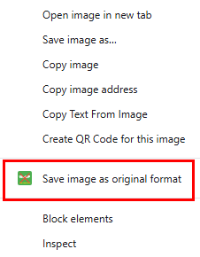

# No WebP - Original Image Formats Extension

A Chrome Extension (Manifest V3) that prevents WebP and AVIF formats, ensuring images load and save in their original formats (GIF, PNG, JPG).



## Features

### 🚫 Network-Level WebP Blocking
- Uses **Declarative Net Request** to modify `Accept` headers, removing `image/webp` and `image/avif`
- Forces servers to fall back to original formats (GIF, PNG, JPG)
- Optional URL parameter rewriting to strip WebP-forcing parameters

### 🖼️ DOM-Level Fallback
- Content script runs at `document_start` to intercept image loading
- Removes or demotes `<source type="image/webp">` in `<picture>` elements
- Selects non-WebP candidates from `srcset` attributes
- Works with lazy loading via MutationObserver

### 💾 Save Images in Original Format
- Right-click context menu: "Save image as original format"
- Re-fetches images with modified headers to get original format
- Automatically detects correct file extension from Content-Type
- Handles `<picture>`, `srcset`, and regular images

### ⚙️ Configurable Settings
- Enable/disable WebP blocking globally
- Manage per-site allowlist for sites that require WebP
- Toggle URL parameter rewriting
- Beautiful, modern options page

## Installation

### Load Extension in Chrome

1. **Open Chrome and navigate to** `chrome://extensions/`

2. **Enable "Developer mode"** (toggle in top-right corner)

3. **Click "Load unpacked"**

4. **Select the extension directory** (folder containing `manifest.json`)

5. **Verify Installation**:
   - The extension should appear in your extensions list
   - Click "Options" to configure settings if needed

For detailed installation instructions, see `INSTALLATION_GUIDE.md`.

## Usage

### Basic Usage

Once installed, the extension automatically:
- Blocks WebP/AVIF requests at the network level
- Modifies DOM to prefer original formats
- Allows right-click saving of images in original format

### Configuration

Click the extension icon or go to **Options** to:

1. **Enable/Disable WebP Blocking**
   - Toggle the main functionality on/off
   - Useful for troubleshooting or temporary disable

2. **URL Rewriting**
   - Removes query parameters that force WebP (e.g., `fm=webp`, `format=webp`)
   - Toggle on/off based on your needs

3. **Site Allowlist**
   - **Default allowlist**: Reddit (reddit.com and related domains) is pre-configured since it only serves WebP
   - Add additional domains where WebP should NOT be blocked
   - Useful for sites that only serve images in WebP format
   - Example: `example.com`, `cdn.example.com`
   - You can remove default sites if needed (though they may not function properly)

### Saving Images

**Method 1: Context Menu**
1. Right-click any image
2. Select "Save image as original format"
3. Image is re-fetched with original format headers
4. Downloads with correct file extension

**Method 2: Regular Save**
- Since WebP is blocked at network level, regular "Save image as..." should also work

## Testing

Test the extension on these sites known to serve WebP:

- **Google Images**: https://images.google.com (should show original formats)
- **Reddit**: https://www.reddit.com (on allowlist by default, will show WebP)
- **Twitter**: https://twitter.com (should show original formats)
- **Imgur**: https://imgur.com (should show original formats)
- **Wikipedia**: https://www.wikipedia.org (should show original formats)

**Note**: Reddit is on the default allowlist because it only serves WebP. To test WebP blocking on Reddit, you would need to remove it from the allowlist (though images may not load).

### Verification Steps

1. **Check Network Tab**:
   - Open DevTools (F12) → Network tab
   - Filter by "Img"
   - Load a page with images
   - Verify images are loading as GIF/PNG/JPG instead of WebP

2. **Check Accept Header**:
   - In Network tab, click an image request
   - Check Headers → Request Headers
   - Verify Accept header does NOT include `image/webp` or `image/avif`

3. **Test GIF Animation**:
   - Find an animated GIF
   - Verify it displays correctly (not as static WebP)
   - Right-click → "Save image as original format"
   - Verify saved file is `.gif` and animates

4. **Check Console**:
   - Look for extension logs
   - No errors should appear

## Project Structure

```
chrome-nowebp/
├── manifest.json           # Extension manifest (MV3)
├── background.js          # Service worker (DNR, context menu)
├── content.js             # Content script (DOM manipulation)
├── options.html           # Options page UI
├── options.js             # Options page logic
├── icons/                 # Extension icons
│   ├── icon16.png        # 16x16 toolbar icon
│   ├── icon48.png        # 48x48 management icon
│   ├── icon128.png       # 128x128 store icon
│   └── icon.svg          # SVG source
├── README.md             # This file
└── INSTALLATION_GUIDE.md # Installation instructions
```

## Technical Details

### Manifest V3 Features

- **declarativeNetRequest**: Modify headers and URLs at network level
- **Service Worker**: Background script with persistence
- **Content Scripts**: Run at `document_start` for early interception
- **Chrome Storage API**: Sync settings across devices

### DNR Rules

The extension creates dynamic rules to:
1. **Modify Accept header**: Remove WebP/AVIF mime types from image requests
2. **Redirect URLs**: Strip WebP-forcing parameters (optional)

### Content Script Strategy

1. **Initial Processing**: Process existing images on page load
2. **MutationObserver**: Watch for dynamically added images
3. **Picture Elements**: Remove WebP/AVIF sources
4. **Srcset Handling**: Select best non-WebP candidate based on DPR

### Context Menu Implementation

1. User right-clicks image
2. Extension fetches image URL with modified Accept header
3. Inspects Content-Type to determine format
4. Downloads with correct file extension

## Troubleshooting

### Images Still Loading as WebP

1. Check if extension is enabled (Options page)
2. **Check if site is on the allowlist** - Reddit and related domains are on the default allowlist
3. Check browser console for errors
4. Some CDNs may only serve WebP with no fallback - add these sites to allowlist if they break

### Save Not Working

1. Ensure Downloads permission is granted
2. Check popup blocker settings
3. Some sites may block cross-origin fetches

### Performance Issues

1. Disable URL rewriting if causing problems
2. Add problematic sites to allowlist
3. Check console for excessive logs

## Known Limitations

1. **CDN Limitations**: Some CDNs only serve WebP - no fallback available
2. **Cross-Origin Restrictions**: Some images can't be re-fetched due to CORS
3. **Srcset Complexity**: Complex srcset with mixed formats may not always select optimally
4. **Background Images**: CSS background images are not currently handled

## Contributing

Feel free to submit issues, fork the repository, and create pull requests for any improvements.

## License

This project is provided as-is for educational and practical use.

## Changelog

### Version 1.0.0 (Initial Release)
- Network-level WebP/AVIF blocking via DNR
- DOM fallback for picture and srcset elements
- Context menu for saving images in original format
- Options page with allowlist management
- URL parameter rewriting (optional)
- Default allowlist for WebP-only sites (Reddit and related domains)

